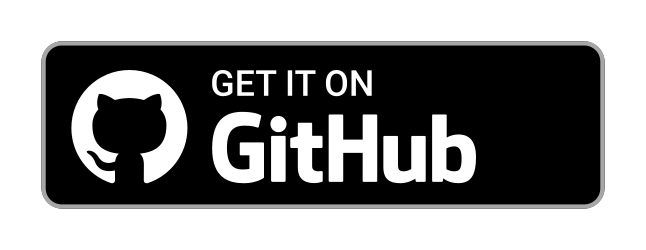

# ShareX - File sharing, simplified.
### Sending and receiving of files in hassle-free way with fast speed!

### Don't forget to ⭐ the repo!
[](https://github.com/akanshSirohi/shareX)
[](https://github.com/akanshSirohi/shareX/releases/)
[](#license)
[](https://github.com/akanshSirohi/shareX)
[](https://github.com/akanshSirohi/shareX)
<br>

## Features
- Share files over the same Wi-Fi network or hotspot. Nearby devices connect through a browser; they do not need the ShareX app.
- Choose a shared folder or use Private mode to share only selected files.
- Browse, preview, upload, download, and manage shared files from the web interface. Restrict file changes when needed.
- Approve browser access, remember trusted browsers, and revoke access later.
- Scan connection QR codes to open another ShareX device.
- Track transfers in history, view live transfer speeds, and follow transfer progress.
- Install plugins from the Store or ZIP files, manage installed plugins, and develop plugins on a computer.
- Configure the sharing port, HTTPS, hidden files, and web interface themes.
- Local file transfers work without an internet connection. Internet access is used for online features such as the plugin Store.

## Download
[](https://f-droid.org/packages/com.akansh.fileserversuit/)
[](https://github.com/akanshSirohi/ShareX/releases)
[](https://t.me/sharex_app)

     
## Screenshots
    

## License
```
Copyright © 2022 Akansh Sirohi

ShareX is a free software licensed under AGPL v3.0
It is distributed in the hope that it will be useful, but WITHOUT ANY WARRANTY;
without even the implied warranty of MERCHANTABILITY or FITNESS FOR A PARTICULAR PURPOSE.
```

```
Being Open Source doesn't mean you can just make a copy of the app and upload it on playstore or sell
a closed source copy of the same.

Read the following carefully:
1. Any copy of a software under AGPL must be under same license. So you can't upload the app on a closed source
  app repository like PlayStore/AppStore without distributing the source code.
2. You can't sell any copied/modified version of the app under any "non-free" license.
   You must provide the copy with the original software or with instructions on how to obtain original software,
   should clearly state all changes, should clearly disclose full source code, should include same license
   and all copyrights should be retained.
3. If you distribute this app, you must give attribution to the original author and display a copy of the license.

In simple words, You can ONLY use the source code of this app for `Open Source` Project under `AGPL v3.0` or later
with all your source code CLEARLY DISCLOSED on any code hosting platform like GitHub, with clear INSTRUCTIONS on
how to obtain the original software, you must give attribution to the ORIGINAL AUTHOR, should clearly STATE ALL CHANGES 
made and should RETAIN all copyrights.

Use of this software under any "non-free" license is NOT permitted.
```
See the [GNU General Public License](https://github.com/akanshSirohi/ShareX/blob/master/LICENSE) for more details.

## Building from Source

1. If you don't have Android Studio & Android SDK installed, please visit official [Android Studio](https://developer.android.com/studio) site.
2. Fetch latest source code from master branch.
```
git clone https://github.com/akanshSirohi/ShareX.git
```
3. Run the app with Android Studio.

The web portal source lives in `web/`. See [the portal build guide](web/README.md) for development, static export, and copying the build into Android assets.

## Plugin development and local installation

You can develop plugins on your computer without copying source files onto the phone:

1. Run ShareX and start sharing on the same Wi-Fi or hotspot as your computer.
2. Open Settings, enable **Plugin development**, and wait for sharing to restart.
3. Tap the connection button beside the development switch and select **Copy connection**.
4. Run the [Next.js starter](https://github.com/akanshSirohi/ShareX-Plugins/tree/master/sharex.starter.plugin) with `npm run dev`. Paste the connection into the starter page.

The app provides WebSocket messaging, connected browser information, and persistent plugin storage. The socket uses the sharing port plus one, supports HTTPS through `wss://`, and keeps development data separate from installed plugins. Development keys authorize plugin sockets only. Disable development or reset the key to revoke connected clients. The optional folder button remains available for legacy on-phone debugging.

To install a packaged plugin, open **Plugins > Install from ZIP**, choose the ZIP, and confirm the trust warning only if you trust the plugin. The ZIP must contain `config.json` and `index.html` at its root. Local imports validate archive paths and sizes before staging the installation, and may replace an existing plugin with the same package and version. Plugin database files are preserved.

## Quick Open ShareX Url In PC
1) Open Notepad
2) Paste the below code in it
```batch
@echo off
powershell.exe -Command "$ip = Get-WmiObject -Class Win32_IP4RouteTable | where { $_.destination -eq '0.0.0.0' -and $_.mask -eq '0.0.0.0'} | Sort-Object metric1 | select nexthop; Start-Process \"http://$($ip.nexthop):6060\""
```
3) Save it with the name `open_sharex.bat`.
4) Double click on it to run anytime you want to open ShareX url in your PC.

## Contribute

Contributions are welcome. Please read our [contributing guidelines](https://github.com/akanshSirohi/ShareX/blob/master/CONTRIBUTING.md) before contributing.

## Liked My Work?
[](https://www.buymeacoffee.com/akanshsirohi)
